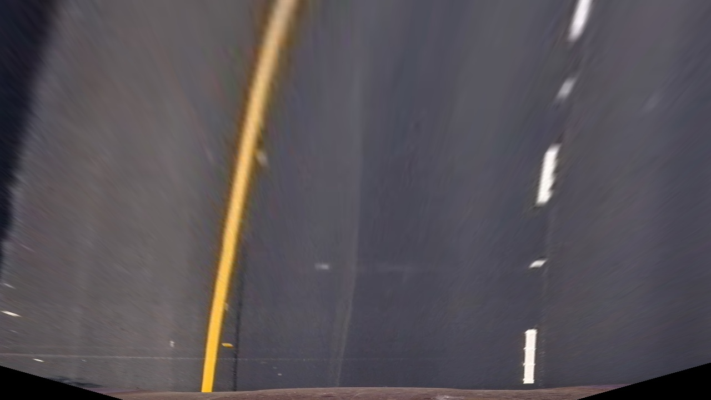
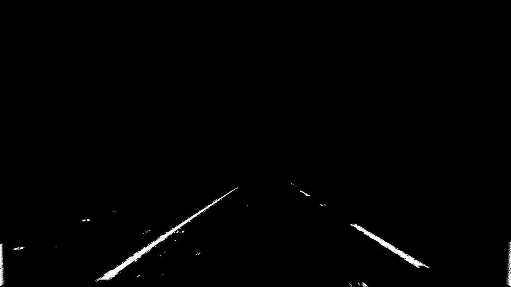
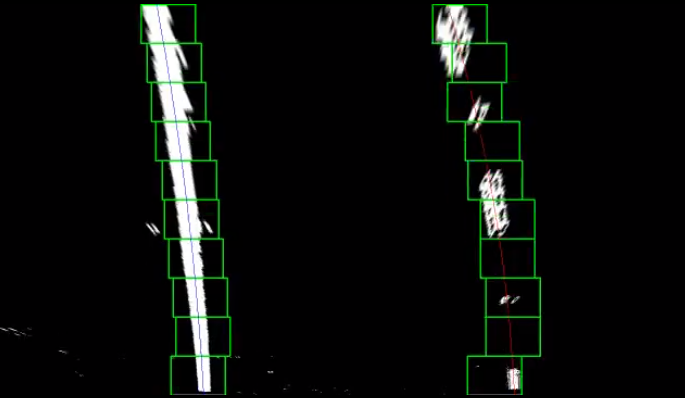
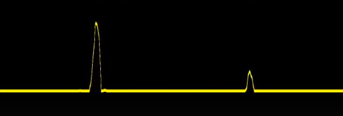
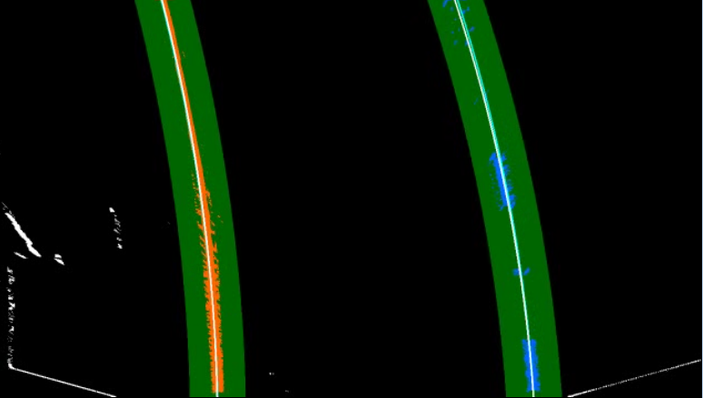

## Advanced Lane Finding Project

The goals / steps of this project are the following:

* Compute the camera calibration matrix and distortion coefficients given a set of chessboard images.
* Apply a distortion correction to raw images.
* Use color transforms, gradients, etc., to create a thresholded binary image.
* Apply a perspective transform to rectify binary image ("birds-eye view").
* Detect lane pixels and fit to find the lane boundary.
* Determine the curvature of the lane and vehicle position with respect to center.
* Warp the detected lane boundaries back onto the original image.
* Output visual display of the lane boundaries and numerical estimation of lane curvature and vehicle position.

## Running

In order to run this pipeline you should run `laneFinder.py` with following parameters:

  `--vid` in case if input is a video, path to the source video file

  `--img` in case if input is an image, path to the source image file

  `--cal` path to the directory with callibration images (default: `../camera_cal`)

  `--o_dir` the path to the output directory (default: `../output_images`)

  `--o_name` the name of the output file (default: `output.mp4`)
  
## Preprocessing

### Camera calibration

An image, that camera captures is inperfect. Because of camera's lenses phisical properties, images, that created by camera contains some distortion in it.
But for lane lines detection we need that camera's image represents real world without any kind of distortion.

In this reason, first thing that we should do is calibrate the camera.

To do that I created module `camera.py` that contains class with the same name `camera`. 
This class has method `calibrate()`. 
In this method we are iterating through the calibration images to find chessbord corners on them and after that use them in `cv2.calibrateCamera()`.
Once calibrated, camera object can be used for image undistortion by calling `undistort()`.

Distorted and undistorted images:

   

### Perspective transformation

Next step is transforming an image to the bird-eye-view. It makes farther detection process much more esier. 
In order to transform perspective i created method `warpPerspective` in the class `camera`. This method just call `cv2.warpPerspective()` with specific parameters.

Transformed image:

Source points | destination points
--- | --- 
[579.681, 458.913] | [350, 0]
[703.423, 458.913] | [850, 0]
[1114.42, 720] | [850, 720]
[198.078, 720] | [350, 720]

### Color and Gradient thresholding

After perspective transformation we need to separate lane lines pexels from any other pixels. 
For this reasone I've used following thresholds:

* HLS color space L- and S-channels
* LAB color space B-channel
* Sobel magnitude 
* Sobel direction
* Sobel absolute in X and Y directions

Thresholded image:

All this threshold implemented in module `preprocessing.py`. 
Function `preprocess_img()` combines all the threshold masks with condition: 
`(((sobel_mask == 1) & (sobel_mask_mag == 1) ) | (sobel_x == 1) & (sobel_y == 1)  | ((hls_s_mask == 1) | (lab_mask == 1) | (hls_mask == 1)))`

## Line detection

### Line

For more convinient work I've created class `Line` that incapsulate methods and fields that allow to save the state of detected line such as if line is detected or line coeficents.

### Sliding windows

To detect lines I've used sliding window approach.
Sliding window search algorithm:
1. Calculate histogram based on bottom half of the image.
2. Find x points with max y value on this histogram
3. Use this points as starting points
4. Create a box witsh center at this base point
5. If in number of pixel in this box big enough, move box up and averege x position with inner points
6. Repeat this for whole image

Sliding windows:

   

Sliding window algorithm implemented in module `detection.py` in function `find_with_sliding_windows()`. This function returns object of type `Line`

### Tracking of found line

Once we detect the line we don't need to use sliding window until we lost the line. Instead, we are searshing for new points around line that was found on a previous frame.

Line tracking:

This tracking is implemented in `detection.py` in method `find_within_line_range()`

